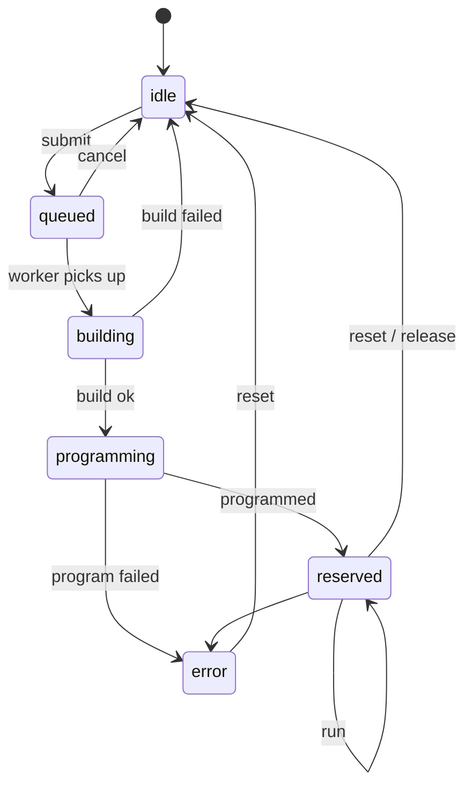
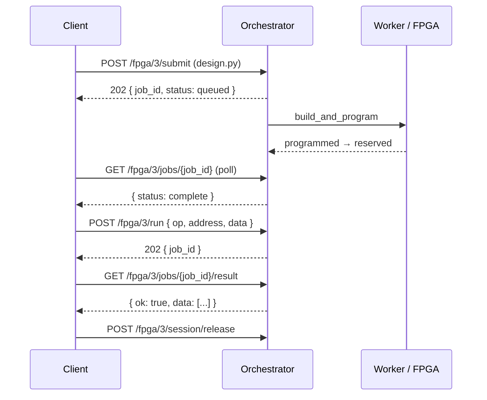

# Architecture

The orchestrator manages a fixed pool of **10 FPGA nodes** (`fpga_id` `0`–`9`).
Every interaction flows through three core concepts: the **FPGA state machine**,
**sessions**, and **jobs**.

## FPGA state machine

Each FPGA is always in exactly one state. Operations are only valid from
certain states, which keeps two users from clobbering the same board.

| State | Meaning |
| --- | --- |
| `idle` | Free. Accepts a new `submit`. |
| `queued` | A build-and-program job is waiting for a worker. |
| `building` | The design is compiling in the build sandbox. |
| `programming` | The bitstream is being flashed onto the board. |
| `reserved` | Programmed and held for the submitter. Accepts `run` transactions. |
| `error` | A program/run step failed. Must be `reset` back to `idle`. |

## Sessions

When a design is successfully programmed, the FPGA becomes `reserved` and a
**session** is created for the submitter. The session ties a board to its owner
and carries a TTL (`expires_at`). While reserved, only the session holder may
run transactions or reset the board.

Releasing a session (`POST /fpga/{id}/session/release`) enqueues a reset job
that returns the FPGA to `idle` once it completes.

!!! warning "Reset is unreliable in the prototype"
    The reset job reflashes the base LiteX SoC, which currently fails and can
    leave the board in `error` instead of `idle`. See
    [Troubleshooting](../guides/troubleshooting.md#fpga-stuck-in-error) for the
    recovery procedure.

## Jobs

All work is asynchronous. An endpoint that changes hardware state returns
**`202 Accepted`** with a `job_id`; you poll the job to follow its progress.

There are three job **types**:

| Type | Triggered by | Does |
| --- | --- | --- |
| `build_and_program` | `POST /fpga/{id}/submit` | Compiles the HDL and flashes the bitstream. |
| `run` | `POST /fpga/{id}/run` | Executes a Wishbone read/write transaction. |
| `reset` | `reset` / `session/release` | Reflashes the base LiteX SoC, returns to idle. |

And five job **statuses**: `queued` → `running` → `complete`, or `failed`, or
`cancelled` (only a `queued` job can be cancelled).

Poll a job with [`GET /fpga/{id}/jobs/{job_id}`](../api/rest.md#jobs); fetch its
build log at `/logs` and, for `run` jobs, its data at `/result`.

## Clocking: sys clock vs. timing target

A `build_and_program` job carries two independent frequencies:

- **Sys clock** — the frequency the SoC actually runs at, produced by the ECP5
  PLL from a fixed 12 MHz input oscillator. This is your design's real clock; the
  default is **50 MHz**. Because the PLL divides that fixed input, only certain
  output frequencies are realizable.
- **Timing target** — the frequency place-and-route is *constrained* to hit
  (`nextpnr --freq`) and the build is *graded* against (a report's `timing_met`).
  It carries no PLL restriction, so it can be any value. It defaults to the sys
  clock.

Keeping them separate lets you ask a timing question the PLL can't answer
directly — "can this design close at 90 MHz?" without re-clocking the SoC — and
grade against thresholds the PLL can't synthesize exactly (e.g. 87.3 MHz). Set
both at submit time with the
[`sys_clk_freq` and `timing_target_mhz`](../api/rest.md#post-fpgafpga_idsubmit)
form fields.

## Putting it together

