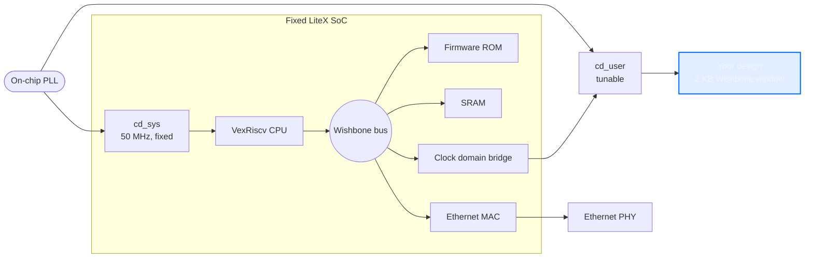

# Hardware & SoC architecture

What's on the other end of `mrg run`: the board, the fixed LiteX SoC every
node boots, and the FPGA resources left over for your design.

## The board

Every node is a Lattice ECP5 FPGA, device `LFE5UM5G-85F-8BG381`. A cluster of
these boards is the pool `mrg run` schedules onto. See the
[CLI guide](../guides/cli.md) for `status` and `reset`.

## System architecture

Every board boots the same LiteX SoC: a VexRiscv CPU, a LiteEth network
stack, and a Wishbone bus, with one pluggable slot for your design.



The control plane (`cd_sys`: CPU, bus, bridge firmware, MAC) always runs at a
fixed 50 MHz, identical on every build. Only `cd_user`, the domain your
design is instantiated in, is tunable. A clock sweep only changes your
design's clock, never the known-good infrastructure around it.

Your side of the contract is a plain Wishbone B4 peripheral, top module
`user_design`:

```text
input  clk, rst
input  wb_cyc, wb_stb, wb_we
input  [8:0]  wb_adr        (32-bit word address, 512 words)
input  [31:0] wb_dat_w
input  [3:0]  wb_sel
output [31:0] wb_dat_r
output        wb_ack        (registered, 1 cycle after cyc & stb)
```

That's the only interface between your logic and the rest of the SoC: one
2 KB MMIO window, nothing else. Everything outside that window (firmware,
CPU memory, networking) is off limits and not reachable from `user_design`.

## Address space

| Region | Address | Size | Access |
| --- | --- | --- | --- |
| **Your design** | `0x90000000` | 2 KB (512 x 32-bit words) | Read and write, this is yours |
| Everything else | n/a | n/a | Off limits, reserved for the SoC |

## FPGA resources

Numbers below are from a real build: the LiteX SoC synthesized and placed
with a no-op placeholder in the user slot, so this is what the CPU, bus, and
networking cost before your design adds a single gate.

**Total available on the chip:**

```text
LUT       83,640
FF        83,640
BRAM         208
DSP          156
PLL            4
IO           365
```

**Used by the SoC (CPU, bus, networking), before your design:**

```text
LUT   [█▒▒▒▒▒▒▒▒▒▒▒▒▒▒▒▒▒▒▒]   6%    5,348
FF    [█▒▒▒▒▒▒▒▒▒▒▒▒▒▒▒▒▒▒▒]   3%    2,718
BRAM  [██▒▒▒▒▒▒▒▒▒▒▒▒▒▒▒▒▒▒]  12%       25
DSP   [▒▒▒▒▒▒▒▒▒▒▒▒▒▒▒▒▒▒▒▒]   2%        4
PLL   [█████▒▒▒▒▒▒▒▒▒▒▒▒▒▒▒]  25%        1
IO    [█▒▒▒▒▒▒▒▒▒▒▒▒▒▒▒▒▒▒▒]   4%       15
```

**Left over for your design:**

```text
LUT   [███████████████████▒]  94%   78,292
FF    [███████████████████▒]  97%   80,922
BRAM  [██████████████████▒▒]  88%      183
DSP   [████████████████████]  98%      152
PLL   [███████████████▒▒▒▒▒]  75%        3
IO    [███████████████████▒]  96%      350
```

The [FFN accelerator example](../examples/ffn-accel.md) is a real design
sized against this same budget (3,437 LUT, 1,505 FF, 40 DSP, 6 BRAM), well
inside what's left over.

One PLL is already spent generating `cd_sys` and `cd_user`. A design that
needs its own independent clock domain has 3 PLLs left, not 4.
